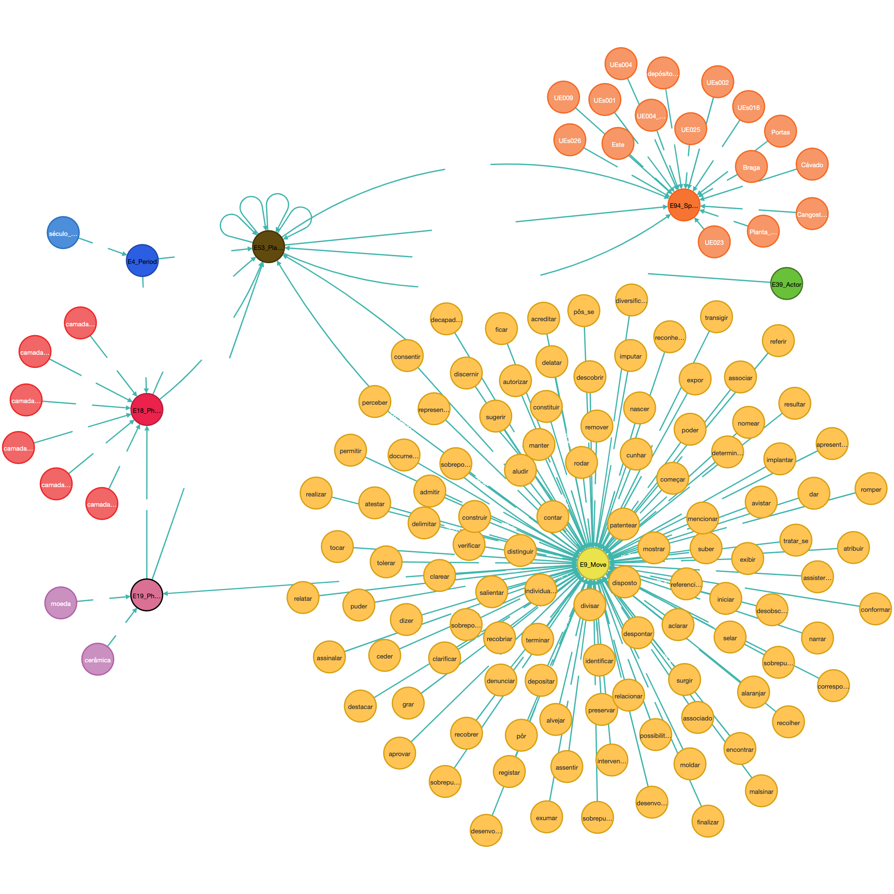

# PI_22-23

## Ontologia Inicial

## Grafo da Ontologia Inicial NetworkX

## Grafo da Ontologia Neo4j

### Padrão para identificar
- [X] **E4 Period (esta a identificar algumas datas e algumas épocas (ex: Século XX), com padrões)**
- [ ] **E53 Place**
- [X] **E18 Physical Thing (esta a utilizar o "text" do token do modelo "pt_core_news_md" para identificar se a palavra é igual a "camada" e se a palavra seguinte for diferente de "ADP","ADV","SCONJ","PUNCT" adiciona a mesma a ontologia)**
- [X] **E19 Physical Object (esta a utilizar a label "OBJ" do modelo "pt_core_news_md")**
- [X] **E94 Space Primitive (esta a utilizar a label "LOC" do modelo "pt_core_news_md")**
- [X] **E39 Actor (esta a utilizar a label "PER" do modelo "pt_core_news_md")** 
- [X] **E9 Move (esta a utilizar o "POS" do token do modelo "pt_core_news_md" para identificar se é um "VERB")**

### Exemplo padrão camadas

## Ontologia Final
