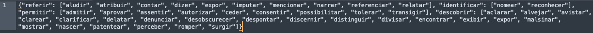

# PI_22-23

# Trabalho: Extração (semi)Automática de uma Ontolo- gia com base em Relatórios Arqueológicos
> Supervisor: obelo@di.uminho.pt\
> As ontologias podem ser descritas como uma estruturas de dados que acolhem os objetos e seus relacionamento (bem como a sua semântica) acerca de um dado domínio de conhecimento. Através de uma ontologia é possível descobrir e explorar o conhecimento nela armazenado presente, de forma muito flexível, de acordo com as várias vertentes do conhecimento nela representado. Neste trabalho pretende-se desenvolver uma aplicação Web que permita fazer a extração (semi) automática do conhecimento contido em relatórios arqueológicos, de forma a disponibilizar uma ontologia específica para esse domínio.\
> Resultado: Aplicação Web

## Ontologia Inicial


## Grafo da Ontologia Inicial NetworkX


## Grafo da Ontologia Neo4j


### Padrão para identificar
- [X] **E4 Period (esta a identificar algumas datas e algumas épocas (ex: Século XX), com padrões)**
- [ ] **E53 Place**
- [X] **E18 Physical Thing (esta a utilizar o "text" do token do modelo "pt_core_news_md" para identificar se a palavra é igual a "camada" e se a palavra seguinte for diferente de "ADP","ADV","SCONJ","PUNCT" adiciona a mesma a ontologia)**
- [X] **E19 Physical Object (esta a utilizar a label "OBJ" do modelo "pt_core_news_md")**
- [X] **E94 Space Primitive (esta a utilizar a label "LOC" do modelo "pt_core_news_md")**
- [X] **E39 Actor (esta a utilizar a label "PER" do modelo "pt_core_news_md")** 
- [X] **E9 Move (esta a utilizar o "POS" do token do modelo "pt_core_news_md" para identificar se é um "VERB")**

### Exemplo padrão camadas


## [Ontologia Final CIDOC-CRM (v 7.2.2)](https://www.cidoc-crm.org/sites/default/files/cidoc_crm_version_7.2.2%5B23%20Nov%5D%5BTRACK%20CHANGES%5D.pdf)


# Como utilizar

## 1. Instalar os requirements
```
pip3 install -r requirements.txt
```

## 2. Colocar o texto que se deseja processar no ficheiro text.txt

## 3. (Opcional) Colocar uma ontologia, sinónimos e/ou lista dos objectos físicos na directoria./db
> **Os nomes dos ficheiros têm de ser "ontology.txt" para a ontologia e "sinonimos.txt" para os sinónimos, no formato de dicionário**\
> **O nome do ficheiro para os objetos tem de ser "physical_objects.txt", no formato de texto separado por ','**
> ### Exemplo ficheiro "ontology.txt"
> 
> ### Exemplo ficheiro "sinonimos.txt"
> 
> ### Exemplo ficheiro "physical_objects.txt"
> 

## 4. Executar o programa
```
python3 p.py
```

## 5. Iniciar o Neo4J
```
./neo4j/neo4j-community-5.4.0/bin/neo4j-admin server console
```

## 6. Cypher para carregar o grafo no Neo4J
> **Alterar os valores "-u neo4j -p neo4jneo4j" para os valores definidos pelo utilizador**
```
./neo4j/cypher-shell-5.4.0/bin/cypher-shell -u neo4j -p neo4jneo4j --format plain < ontology.cypher
```

## 7. Comando para ver todos os nodos
```
MATCH (n) RETURN n
```

# Trabalho realizado por
[João Rodrigues, pg46534](https://github.com/JoaoCPereira)\
[Rolando Silva, pg46543](https://github.com/Rolando2000)\
[Tomás de Sá, pg46544](https://github.com/tomasdesa)
